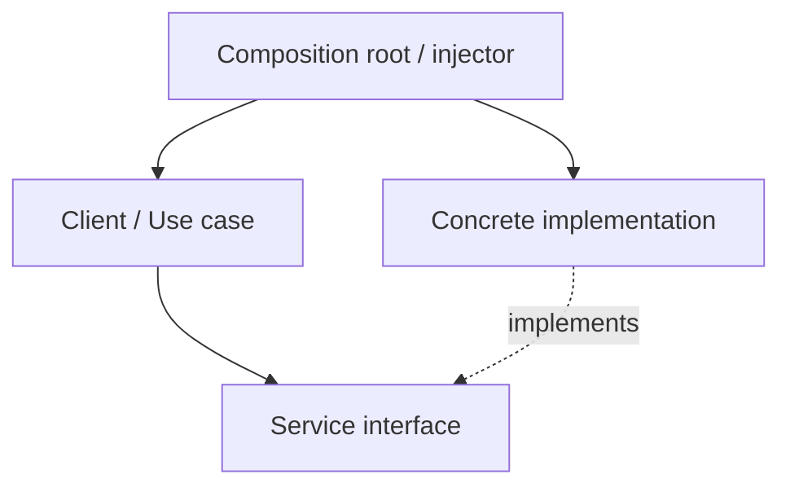

# Dependency Injection (DI)

## Structure (diagram)



Dependencies are **supplied from outside** (constructor, setter, or framework), so classes depend on **abstractions** and tests can swap fakes.

## Python

```python
from abc import ABC, abstractmethod


class Clock(ABC):
    @abstractmethod
    def now_iso(self) -> str: ...


class SystemClock(Clock):
    def now_iso(self) -> str:
        from datetime import datetime

        return datetime.now().isoformat()


class Greeter:
    def __init__(self, clock: Clock) -> None:
        self._clock = clock

    def greet(self) -> None:
        print(f"Hello at {self._clock.now_iso()}")


Greeter(SystemClock()).greet()
```

## Java

```java
interface Clock {
    String nowIso();
}

class SystemClock implements Clock {
    public String nowIso() {
        return java.time.Instant.now().toString();
    }
}

class Greeter {
    private final Clock clock;

    Greeter(Clock clock) {
        this.clock = clock;
    }

    void greet() {
        System.out.println("Hello at " + clock.nowIso());
    }
}

public class Demo {
    public static void main(String[] args) {
        new Greeter(new SystemClock()).greet();
    }
}
```

---

← [Architectural Patterns](../README.md) · [One Pattern hub](../../README.md)
