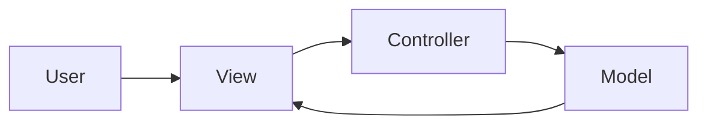

# MVC (Model–View–Controller)

## Structure (diagram)



## Python

```python
# Minimal MVC-style separation (conceptual)

class UserModel:
    def __init__(self) -> None:
        self.name = ""

    def set_name(self, name: str) -> None:
        self.name = name


class UserView:
    def show(self, name: str) -> None:
        print(f"User: {name}")


class UserController:
    def __init__(self, model: UserModel, view: UserView) -> None:
        self._m = model
        self._v = view

    def set_user_name(self, name: str) -> None:
        self._m.set_name(name)
        self._v.show(self._m.name)


UserController(UserModel(), UserView()).set_user_name("Ada")
```

## Java

```java
class UserModel {
    private String name = "";
    void setName(String n) { name = n; }
    String getName() { return name; }
}

class UserView {
    void show(String name) {
        System.out.println("User: " + name);
    }
}

class UserController {
    private final UserModel model;
    private final UserView view;

    UserController(UserModel m, UserView v) {
        model = m;
        view = v;
    }

    void setUserName(String name) {
        model.setName(name);
        view.show(model.getName());
    }
}
```

---

← [Architectural Patterns](../README.md) · [One Pattern hub](../../README.md)
