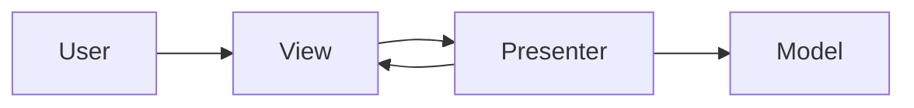

# MVP (Model–View–Presenter)

## Structure (diagram)



The **View** stays passive (mostly interfaces); the **Presenter** holds presentation logic and updates the View.

## Python

```python
# Minimal MVP-style flow

class CounterModel:
    def __init__(self) -> None:
        self.value = 0

    def increment(self) -> None:
        self.value += 1


class CounterView:
    def display(self, text: str) -> None:
        print(text)


class CounterPresenter:
    def __init__(self, model: CounterModel, view: CounterView) -> None:
        self._m = model
        self._v = view

    def user_clicked_increment(self) -> None:
        self._m.increment()
        self._v.display(f"Count: {self._m.value}")


p = CounterPresenter(CounterModel(), CounterView())
p.user_clicked_increment()
```

## Java

```java
class CounterModel {
    private int value = 0;
    void increment() { value++; }
    int getValue() { return value; }
}

class CounterView {
    void display(String s) { System.out.println(s); }
}

class CounterPresenter {
    private final CounterModel model;
    private final CounterView view;

    CounterPresenter(CounterModel m, CounterView v) {
        model = m;
        view = v;
    }

    void userClickedIncrement() {
        model.increment();
        view.display("Count: " + model.getValue());
    }
}
```

---

← [Architectural Patterns](../README.md) · [One Pattern hub](../../README.md)
