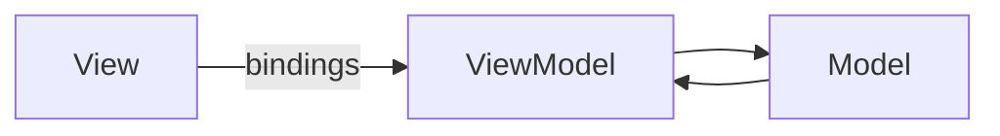

# MVVM (Model–View–ViewModel)

## Structure (diagram)



The **ViewModel** exposes observable state/commands; the **View** binds to it (conceptually like XAML bindings or reactive UI).

## Python

```python
# Sketch: ViewModel holds observable fields; View reads them.

class PersonModel:
    def __init__(self) -> None:
        self.name = "Ada"


class PersonViewModel:
    def __init__(self, model: PersonModel) -> None:
        self._m = model

    @property
    def label_text(self) -> str:
        return f"Hello, {self._m.name}"


class PersonView:
    def render(self, vm: PersonViewModel) -> None:
        print(vm.label_text)


vm = PersonViewModel(PersonModel())
PersonView().render(vm)
```

## Java

```java
class PersonModel {
    String name = "Ada";
}

class PersonViewModel {
    private final PersonModel model;
    PersonViewModel(PersonModel m) { model = m; }
    String getLabelText() { return "Hello, " + model.name; }
}

class PersonView {
    void render(PersonViewModel vm) {
        System.out.println(vm.getLabelText());
    }
}
```

---

← [Architectural Patterns](../README.md) · [One Pattern hub](../../README.md)
