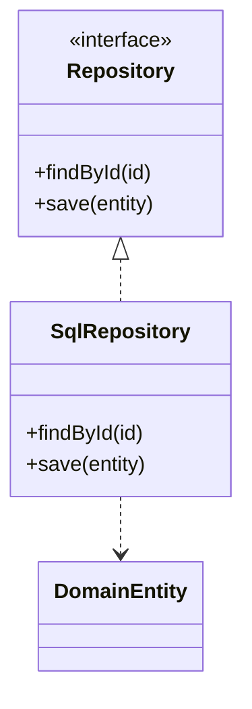

# Repository Pattern

## Structure (diagram)



## Python

```python
from abc import ABC, abstractmethod
from dataclasses import dataclass


@dataclass
class Product:
    id: int
    name: str


class ProductRepository(ABC):
    @abstractmethod
    def find_by_id(self, pid: int) -> Product | None: ...

    @abstractmethod
    def save(self, p: Product) -> None: ...


class InMemoryProductRepository(ProductRepository):
    def __init__(self) -> None:
        self._data: dict[int, Product] = {}

    def find_by_id(self, pid: int) -> Product | None:
        return self._data.get(pid)

    def save(self, p: Product) -> None:
        self._data[p.id] = p


repo: ProductRepository = InMemoryProductRepository()
repo.save(Product(1, "Book"))
print(repo.find_by_id(1))
```

## Java

```java
import java.util.*;

interface ProductRepository {
    Product findById(int id);
    void save(Product p);
}

class Product {
    final int id;
    final String name;
    Product(int id, String name) {
        this.id = id;
        this.name = name;
    }
}

class InMemoryProductRepository implements ProductRepository {
    private final Map<Integer, Product> data = new HashMap<>();

    public Product findById(int id) {
        return data.get(id);
    }

    public void save(Product p) {
        data.put(p.id, p);
    }
}
```
