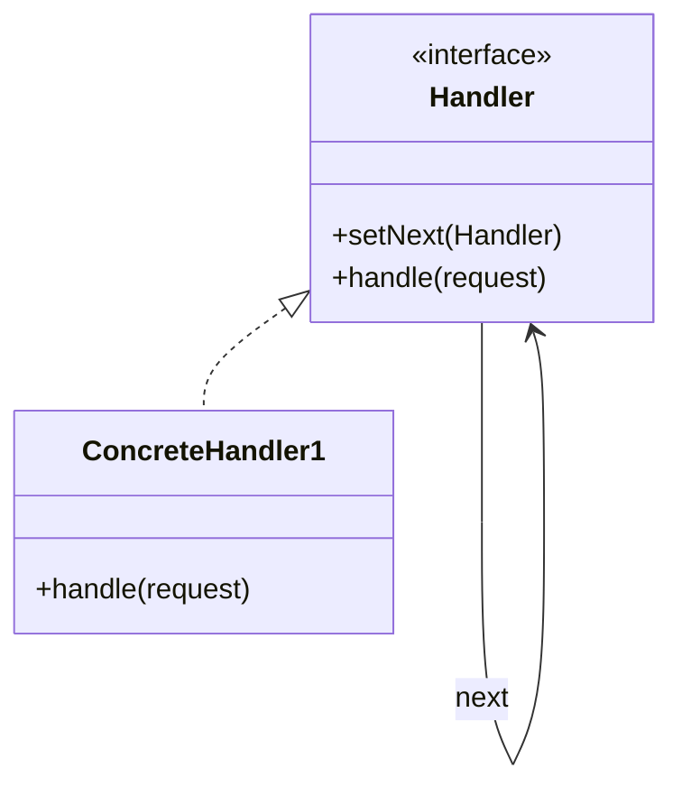

# Chain of Responsibility Pattern

## Structure (diagram)



## Python

```python
from abc import ABC, abstractmethod


class Handler(ABC):
    def __init__(self) -> None:
        self._next: Handler | None = None

    def set_next(self, h: "Handler") -> "Handler":
        self._next = h
        return h

    @abstractmethod
    def handle(self, amount: int) -> str | None:
        ...

    def _forward(self, amount: int) -> str | None:
        return self._next.handle(amount) if self._next else None


class Manager(Handler):
    def handle(self, amount: int) -> str | None:
        if amount <= 1000:
            return "manager approved"
        return self._forward(amount)


class Director(Handler):
    def handle(self, amount: int) -> str | None:
        if amount <= 5000:
            return "director approved"
        return self._forward(amount)


m = Manager()
m.set_next(Director())
print(m.handle(300))
```

## Java

```java
abstract class Handler {
    private Handler next;
    Handler setNext(Handler n) {
        next = n;
        return n;
    }
    abstract String handle(int amount);
    String forward(int amount) {
        return next != null ? next.handle(amount) : null;
    }
}

class Manager extends Handler {
    String handle(int amount) {
        if (amount <= 1000) return "manager approved";
        return forward(amount);
    }
}

class Director extends Handler {
    String handle(int amount) {
        if (amount <= 5000) return "director approved";
        return forward(amount);
    }
}
```
