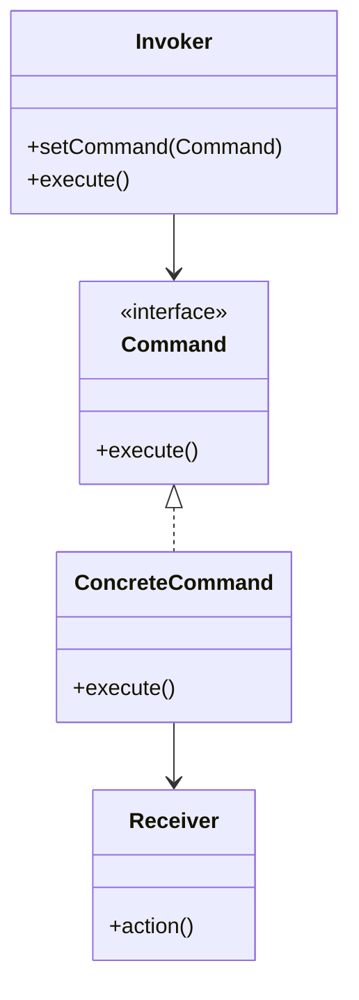

# Command Pattern

## Structure (diagram)



## Python

```python
from abc import ABC, abstractmethod


class Light:
    def on(self) -> None:
        print("light on")


class Command(ABC):
    @abstractmethod
    def execute(self) -> None: ...


class LightOnCommand(Command):
    def __init__(self, light: Light) -> None:
        self._light = light

    def execute(self) -> None:
        self._light.on()


class Remote:
    def __init__(self) -> None:
        self._cmd: Command | None = None

    def set_command(self, c: Command) -> None:
        self._cmd = c

    def press(self) -> None:
        if self._cmd:
            self._cmd.execute()


r = Remote()
r.set_command(LightOnCommand(Light()))
r.press()
```

## Java

```java
interface Command {
    void execute();
}

class Light {
    void on() { System.out.println("light on"); }
}

class LightOnCommand implements Command {
    private final Light light;
    LightOnCommand(Light light) { this.light = light; }
    public void execute() { light.on(); }
}

class Remote {
    private Command cmd;
    void setCommand(Command c) { this.cmd = c; }
    void press() { if (cmd != null) cmd.execute(); }
}
```
