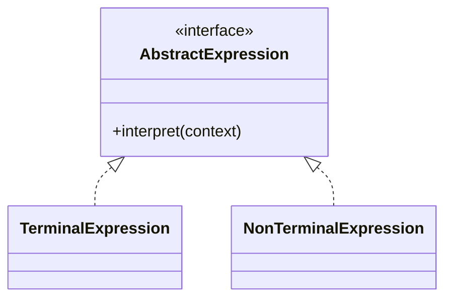

# Interpreter Pattern

## Structure (diagram)



## Python

```python
from abc import ABC, abstractmethod


class Expr(ABC):
    @abstractmethod
    def interpret(self, ctx: dict[str, int]) -> int: ...


class Number(Expr):
    def __init__(self, value: int) -> None:
        self._value = value

    def interpret(self, ctx: dict[str, int]) -> int:
        return self._value


class Variable(Expr):
    def __init__(self, name: str) -> None:
        self._name = name

    def interpret(self, ctx: dict[str, int]) -> int:
        return ctx[self._name]


class Add(Expr):
    def __init__(self, left: Expr, right: Expr) -> None:
        self._left = left
        self._right = right

    def interpret(self, ctx: dict[str, int]) -> int:
        return self._left.interpret(ctx) + self._right.interpret(ctx)


# interprets (x + 3) with x=10
expr = Add(Variable("x"), Number(3))
print(expr.interpret({"x": 10}))
```

## Java

```java
import java.util.*;

interface Expr {
    int interpret(Map<String, Integer> ctx);
}

class Number implements Expr {
    private final int value;
    Number(int v) { this.value = v; }
    public int interpret(Map<String, Integer> ctx) { return value; }
}

class Variable implements Expr {
    private final String name;
    Variable(String name) { this.name = name; }
    public int interpret(Map<String, Integer> ctx) {
        return ctx.get(name);
    }
}

class Add implements Expr {
    private final Expr left, right;
    Add(Expr l, Expr r) { left = l; right = r; }
    public int interpret(Map<String, Integer> ctx) {
        return left.interpret(ctx) + right.interpret(ctx);
    }
}
```
