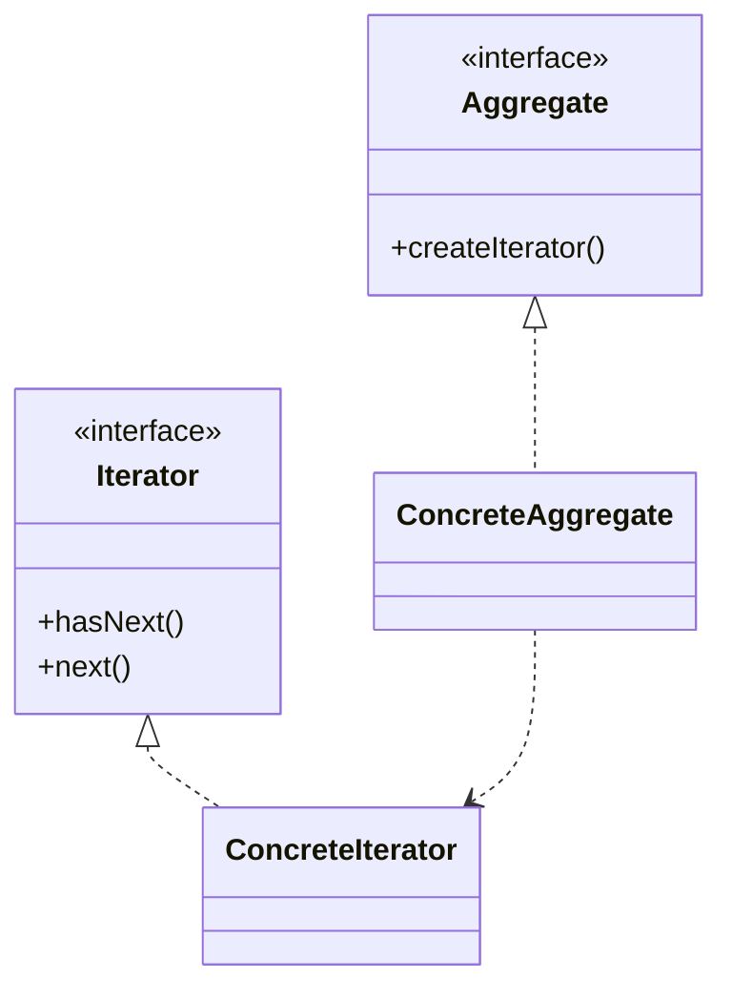

# Iterator Pattern

## Structure (diagram)



## Python

```python
from __future__ import annotations
from typing import Iterator as TypingIter


class BookShelf:
    def __init__(self) -> None:
        self._books: list[str] = []

    def add(self, title: str) -> None:
        self._books.append(title)

    def __iter__(self) -> TypingIter[str]:
        return iter(self._books)


shelf = BookShelf()
shelf.add("A")
shelf.add("B")
for b in shelf:
    print(b)
```

## Java

```java
import java.util.*;

class BookShelf implements Iterable<String> {
    private final List<String> books = new ArrayList<>();
    void add(String title) { books.add(title); }
    public Iterator<String> iterator() {
        return books.iterator();
    }
}

public class Demo {
    public static void main(String[] args) {
        BookShelf s = new BookShelf();
        s.add("A");
        s.add("B");
        for (String b : s) System.out.println(b);
    }
}
```
