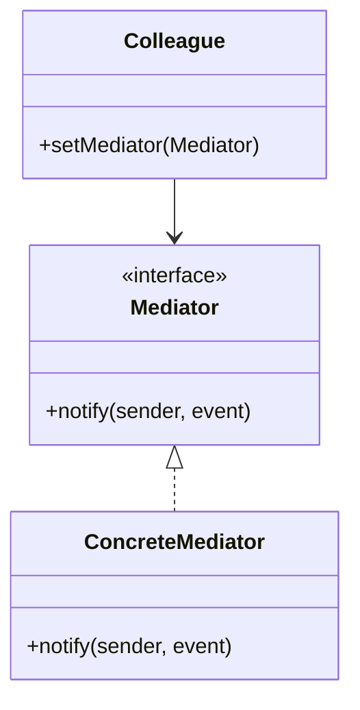

# Mediator Pattern

## Structure (diagram)



## Python

```python
from abc import ABC, abstractmethod


class Mediator(ABC):
    @abstractmethod
    def broadcast(self, sender: str, msg: str) -> None: ...


class ChatRoom(Mediator):
    def __init__(self) -> None:
        self._users: dict[str, "User"] = {}

    def register(self, user: "User") -> None:
        self._users[user.name] = user

    def broadcast(self, sender: str, msg: str) -> None:
        for name, u in self._users.items():
            if name != sender:
                u.receive(msg)


class User:
    def __init__(self, name: str, room: ChatRoom) -> None:
        self.name = name
        self._room = room
        room.register(self)

    def send(self, msg: str) -> None:
        self._room.broadcast(self.name, msg)

    def receive(self, msg: str) -> None:
        print(f"{self.name} got: {msg}")


room = ChatRoom()
User("Alice", room).send("hi")
```

## Java

```java
import java.util.*;

interface Mediator {
    void broadcast(String sender, String msg);
}

class ChatRoom implements Mediator {
    private final Map<String, User> users = new HashMap<>();
    void register(User u) { users.put(u.name, u); }
    public void broadcast(String sender, String msg) {
        for (User u : users.values())
            if (!u.name.equals(sender)) u.receive(msg);
    }
}

class User {
    final String name;
    private final Mediator room;
    User(String name, ChatRoom room) {
        this.name = name;
        this.room = room;
        room.register(this);
    }
    void send(String msg) { room.broadcast(name, msg); }
    void receive(String msg) { System.out.println(name + " got: " + msg); }
}
```
