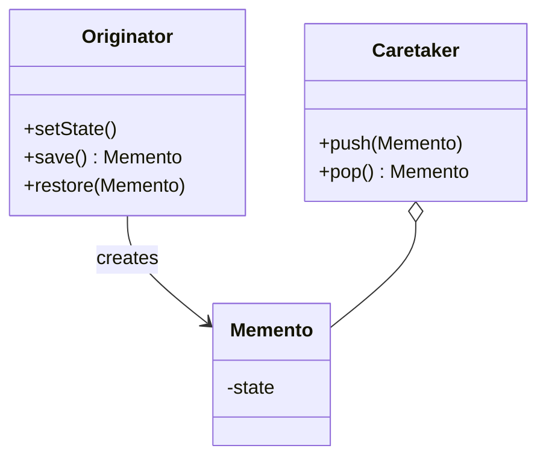

# Memento Pattern

## Structure (diagram)



## Python

```python
from dataclasses import dataclass


@dataclass(frozen=True)
class Memento:
    text: str


class Editor:
    def __init__(self) -> None:
        self.text = ""

    def write(self, s: str) -> None:
        self.text += s

    def save(self) -> Memento:
        return Memento(self.text)

    def restore(self, m: Memento) -> None:
        self.text = m.text


class History:
    def __init__(self) -> None:
        self._stack: list[Memento] = []

    def push(self, m: Memento) -> None:
        self._stack.append(m)

    def pop(self) -> Memento | None:
        return self._stack.pop() if self._stack else None


e = Editor()
h = History()
e.write("hi")
h.push(e.save())
e.write("!!!")
e.restore(h.pop() or Memento(""))
print(e.text)
```

## Java

```java
import java.util.*;

final class Memento {
    private final String text;
    Memento(String text) { this.text = text; }
    String getText() { return text; }
}

class Editor {
    private String text = "";
    void write(String s) { text += s; }
    Memento save() { return new Memento(text); }
    void restore(Memento m) { text = m.getText(); }
}

class History {
    private final Deque<Memento> stack = new ArrayDeque<>();
    void push(Memento m) { stack.push(m); }
    Memento pop() { return stack.isEmpty() ? null : stack.pop(); }
}
```
