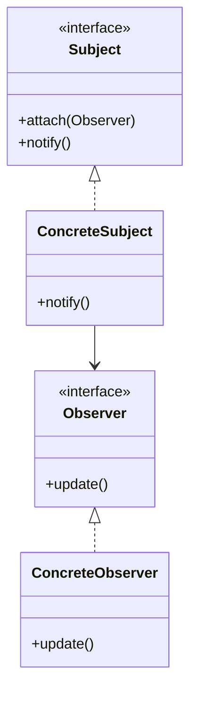

# Observer Pattern

## Structure (diagram)



## Python

```python
from abc import ABC, abstractmethod


class Observer(ABC):
    @abstractmethod
    def update(self, value: int) -> None: ...


class Subject:
    def __init__(self) -> None:
        self._observers: list[Observer] = []

    def attach(self, o: Observer) -> None:
        self._observers.append(o)

    def _notify(self, value: int) -> None:
        for o in self._observers:
            o.update(value)


class Stock(Subject):
    def __init__(self) -> None:
        super().__init__()
        self._price = 0

    @property
    def price(self) -> int:
        return self._price

    @price.setter
    def price(self, v: int) -> None:
        self._price = v
        self._notify(v)


class PrintObserver(Observer):
    def update(self, value: int) -> None:
        print(f"price={value}")


s = Stock()
s.attach(PrintObserver())
s.price = 42
```

## Java

```java
import java.util.*;

interface Observer {
    void update(int value);
}

interface Subject {
    void attach(Observer o);
}

class Stock implements Subject {
    private final List<Observer> observers = new ArrayList<>();
    private int price;

    public void attach(Observer o) { observers.add(o); }

    void setPrice(int v) {
        price = v;
        for (Observer o : observers) o.update(v);
    }
}

class PrintObserver implements Observer {
    public void update(int value) {
        System.out.println("price=" + value);
    }
}
```
