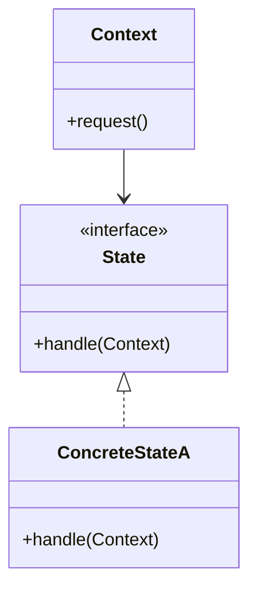

# State Pattern

## Structure (diagram)



## Python

```python
from abc import ABC, abstractmethod


class GateState(ABC):
    @abstractmethod
    def enter(self, gate: "Gate") -> None: ...

    @abstractmethod
    def pay_ok(self, gate: "Gate") -> None: ...


class Locked(GateState):
    def enter(self, gate: "Gate") -> None:
        print("locked")

    def pay_ok(self, gate: "Gate") -> None:
        gate.state = Unlocked()


class Unlocked(GateState):
    def enter(self, gate: "Gate") -> None:
        print("pass")
        gate.state = Locked()

    def pay_ok(self, gate: "Gate") -> None:
        print("already unlocked")


class Gate:
    def __init__(self) -> None:
        self.state: GateState = Locked()

    def enter(self) -> None:
        self.state.enter(self)

    def pay_ok(self) -> None:
        self.state.pay_ok(self)


g = Gate()
g.pay_ok()
g.enter()
```

## Java

```java
interface GateState {
    void enter(Gate gate);
    void payOk(Gate gate);
}

class Locked implements GateState {
    public void enter(Gate gate) { System.out.println("locked"); }
    public void payOk(Gate gate) { gate.setState(new Unlocked()); }
}

class Unlocked implements GateState {
    public void enter(Gate gate) {
        System.out.println("pass");
        gate.setState(new Locked());
    }
    public void payOk(Gate gate) {
        System.out.println("already unlocked");
    }
}

class Gate {
    private GateState state = new Locked();
    void setState(GateState s) { state = s; }
    void enter() { state.enter(this); }
    void payOk() { state.payOk(this); }
}
```
