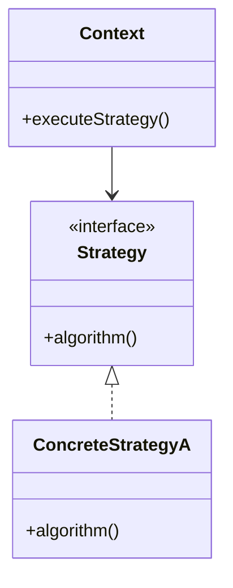

# Strategy Pattern

## Structure (diagram)



## Python

```python
from abc import ABC, abstractmethod


class SortStrategy(ABC):
    @abstractmethod
    def sort(self, data: list[int]) -> list[int]: ...


class BubbleSort(SortStrategy):
    def sort(self, data: list[int]) -> list[int]:
        a = data[:]
        for i in range(len(a)):
            for j in range(len(a) - 1 - i):
                if a[j] > a[j + 1]:
                    a[j], a[j + 1] = a[j + 1], a[j]
        return a


class Sorter:
    def __init__(self, strategy: SortStrategy) -> None:
        self._strategy = strategy

    def sort(self, data: list[int]) -> list[int]:
        return self._strategy.sort(data)


print(Sorter(BubbleSort()).sort([3, 1, 2]))
```

## Java

```java
import java.util.*;

interface SortStrategy {
    List<Integer> sort(List<Integer> data);
}

class BubbleSort implements SortStrategy {
    public List<Integer> sort(List<Integer> data) {
        List<Integer> a = new ArrayList<>(data);
        for (int i = 0; i < a.size(); i++)
            for (int j = 0; j < a.size() - 1 - i; j++)
                if (a.get(j) > a.get(j + 1)) {
                    int t = a.get(j);
                    a.set(j, a.get(j + 1));
                    a.set(j + 1, t);
                }
        return a;
    }
}

class Sorter {
    private final SortStrategy strategy;
    Sorter(SortStrategy s) { this.strategy = s; }
    List<Integer> sort(List<Integer> data) { return strategy.sort(data); }
}
```
