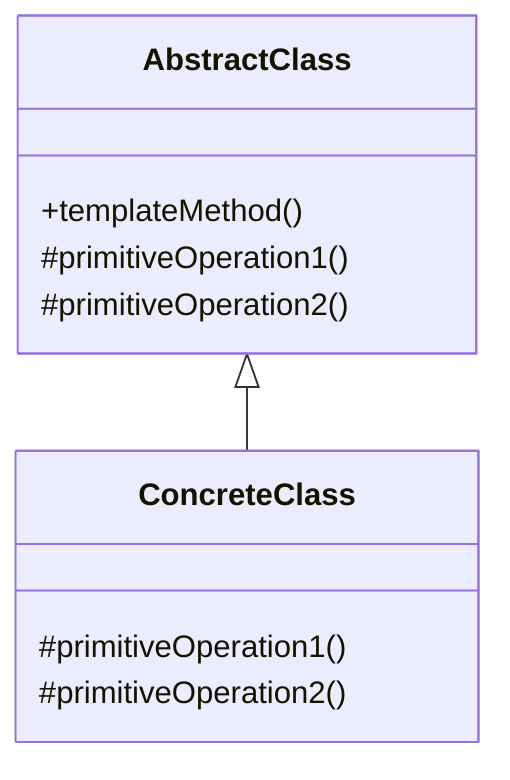

# Template Method Pattern

## Structure (diagram)



## Python

```python
from abc import ABC, abstractmethod


class DataMiner(ABC):
    def mine(self, path: str) -> None:
        raw = self._extract(path)
        data = self._parse(raw)
        self._analyze(data)

    @abstractmethod
    def _extract(self, path: str) -> str:
        ...

    @abstractmethod
    def _parse(self, raw: str) -> dict:
        ...

    def _analyze(self, data: dict) -> None:
        print(f"analyze {data}")


class CsvMiner(DataMiner):
    def _extract(self, path: str) -> str:
        return "a,b"

    def _parse(self, raw: str) -> dict:
        return {"cols": raw.split(",")}


CsvMiner().mine("file.csv")
```

## Java

```java
abstract class DataMiner {
    final void mine(String path) {
        String raw = extract(path);
        Object data = parse(raw);
        analyze(data);
    }
    abstract String extract(String path);
    abstract Object parse(String raw);
    void analyze(Object data) {
        System.out.println("analyze " + data);
    }
}

class CsvMiner extends DataMiner {
    String extract(String path) { return "a,b"; }
    Object parse(String raw) { return raw.split(","); }
}
```
