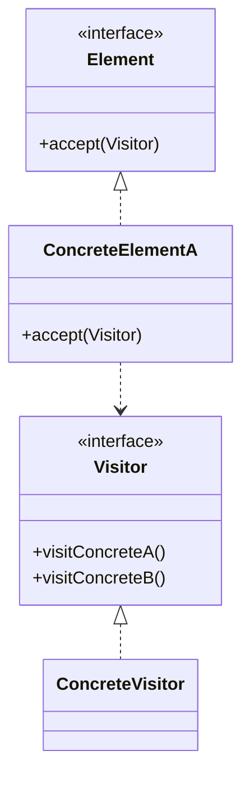

# Visitor Pattern

## Structure (diagram)



## Python

```python
from abc import ABC, abstractmethod


class Visitor(ABC):
    @abstractmethod
    def visit_dot(self, d: "Dot") -> None: ...

    @abstractmethod
    def visit_circle(self, c: "Circle") -> None: ...


class Shape(ABC):
    @abstractmethod
    def accept(self, v: Visitor) -> None: ...


class Dot(Shape):
    def accept(self, v: Visitor) -> None:
        v.visit_dot(self)


class Circle(Shape):
    def __init__(self, r: float) -> None:
        self.r = r

    def accept(self, v: Visitor) -> None:
        v.visit_circle(self)


class AreaVisitor(Visitor):
    def visit_dot(self, d: Dot) -> None:
        print("dot area ~ 0")

    def visit_circle(self, c: Circle) -> None:
        print(3.14 * c.r * c.r)


shapes: list[Shape] = [Dot(), Circle(2)]
for s in shapes:
    s.accept(AreaVisitor())
```

## Java

```java
interface Visitor {
    void visitDot(Dot d);
    void visitCircle(Circle c);
}

interface Shape {
    void accept(Visitor v);
}

class Dot implements Shape {
    public void accept(Visitor v) { v.visitDot(this); }
}

class Circle implements Shape {
    final double r;
    Circle(double r) { this.r = r; }
    public void accept(Visitor v) { v.visitCircle(this); }
}

class AreaVisitor implements Visitor {
    public void visitDot(Dot d) { System.out.println("dot area ~ 0"); }
    public void visitCircle(Circle c) {
        System.out.println(Math.PI * c.r * c.r);
    }
}
```
