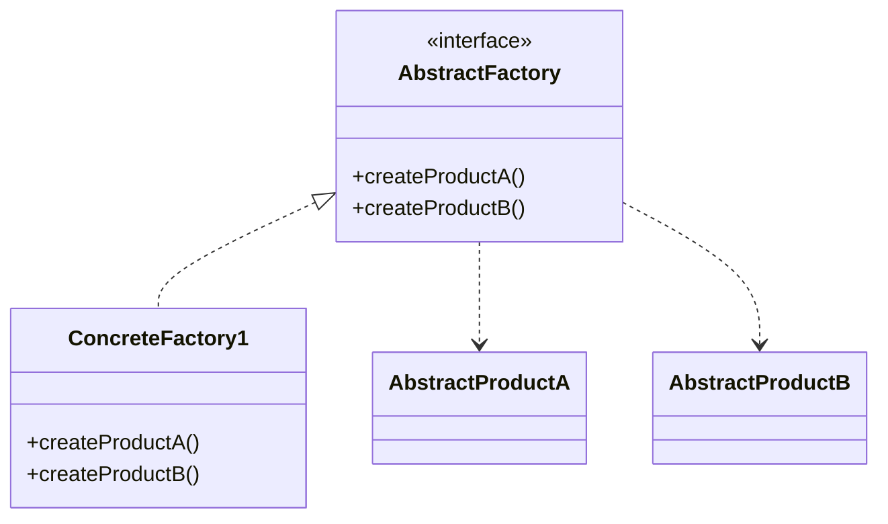

# Abstract Factory Pattern

## Structure (diagram)



## Python

```python
from abc import ABC, abstractmethod


class Button(ABC):
    @abstractmethod
    def paint(self) -> None: ...


class Checkbox(ABC):
    @abstractmethod
    def paint(self) -> None: ...


class WinButton(Button):
    def paint(self) -> None:
        print("Windows button")


class WinCheckbox(Checkbox):
    def paint(self) -> None:
        print("Windows checkbox")


class GUIFactory(ABC):
    @abstractmethod
    def create_button(self) -> Button: ...

    @abstractmethod
    def create_checkbox(self) -> Checkbox: ...


class WindowsFactory(GUIFactory):
    def create_button(self) -> Button:
        return WinButton()

    def create_checkbox(self) -> Checkbox:
        return WinCheckbox()


def client_ui(factory: GUIFactory) -> None:
    factory.create_button().paint()
    factory.create_checkbox().paint()


client_ui(WindowsFactory())
```

## Java

```java
interface Button { void paint(); }
interface Checkbox { void paint(); }

class WinButton implements Button {
    public void paint() { System.out.println("Windows button"); }
}
class WinCheckbox implements Checkbox {
    public void paint() { System.out.println("Windows checkbox"); }
}

interface GUIFactory {
    Button createButton();
    Checkbox createCheckbox();
}

class WindowsFactory implements GUIFactory {
    public Button createButton() { return new WinButton(); }
    public Checkbox createCheckbox() { return new WinCheckbox(); }
}

public class App {
    static void clientUi(GUIFactory f) {
        f.createButton().paint();
        f.createCheckbox().paint();
    }
}
```
