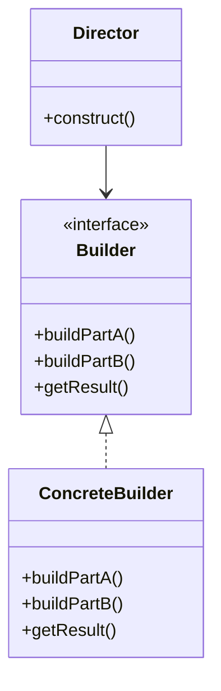

# Builder Pattern

## Structure (diagram)



## Python

```python
class Pizza:
    def __init__(self) -> None:
        self.parts: list[str] = []

    def __str__(self) -> str:
        return ", ".join(self.parts)


class PizzaBuilder:
    def __init__(self) -> None:
        self._pizza = Pizza()

    def add_dough(self) -> "PizzaBuilder":
        self._pizza.parts.append("dough")
        return self

    def add_cheese(self) -> "PizzaBuilder":
        self._pizza.parts.append("cheese")
        return self

    def build(self) -> Pizza:
        return self._pizza


pizza = PizzaBuilder().add_dough().add_cheese().build()
print(pizza)
```

## Java

```java
class Pizza {
    private final java.util.List<String> parts = new java.util.ArrayList<>();
    void add(String p) { parts.add(p); }
    public String toString() { return String.join(", ", parts); }
}

class PizzaBuilder {
    private final Pizza pizza = new Pizza();

    PizzaBuilder addDough() { pizza.add("dough"); return this; }
    PizzaBuilder addCheese() { pizza.add("cheese"); return this; }
    Pizza build() { return pizza; }
}

public class Demo {
    public static void main(String[] args) {
        Pizza p = new PizzaBuilder().addDough().addCheese().build();
        System.out.println(p);
    }
}
```
