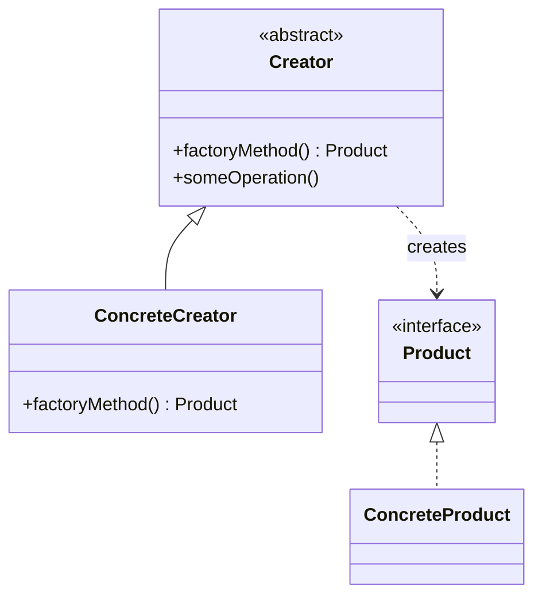

# Factory Method Pattern

## Structure (diagram)



## Python

```python
from abc import ABC, abstractmethod


class Document(ABC):
    @abstractmethod
    def open(self) -> None: ...


class PdfDocument(Document):
    def open(self) -> None:
        print("Open PDF")


class Creator(ABC):
    @abstractmethod
    def factory_method(self) -> Document: ...

    def some_operation(self) -> None:
        doc = self.factory_method()
        doc.open()


class PdfCreator(Creator):
    def factory_method(self) -> Document:
        return PdfDocument()


PdfCreator().some_operation()
```

## Java

```java
interface Document {
    void open();
}

class PdfDocument implements Document {
    public void open() {
        System.out.println("Open PDF");
    }
}

abstract class Creator {
    abstract Document factoryMethod();

    void someOperation() {
        Document doc = factoryMethod();
        doc.open();
    }
}

class PdfCreator extends Creator {
    Document factoryMethod() {
        return new PdfDocument();
    }
}
```
