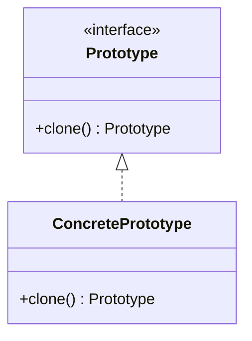

# Prototype Pattern

## Structure (diagram)



## Python

```python
import copy
from dataclasses import dataclass


@dataclass
class Report:
    title: str
    body: str

    def clone(self) -> "Report":
        return copy.deepcopy(self)


original = Report("Q1", "Sales up")
duplicate = original.clone()
duplicate.title = "Q1 copy"
print(original.title, duplicate.title)
```

## Java

```java
interface CloneableReport extends Cloneable {
    CloneableReport clone();
}

class Report implements CloneableReport {
    private String title;
    private String body;

    Report(String title, String body) {
        this.title = title;
        this.body = body;
    }

    @Override
    public CloneableReport clone() {
        return new Report(this.title, this.body);
    }
}

public class Demo {
    public static void main(String[] args) {
        Report r = new Report("Q1", "Sales up");
        Report c = (Report) r.clone();
    }
}
```
