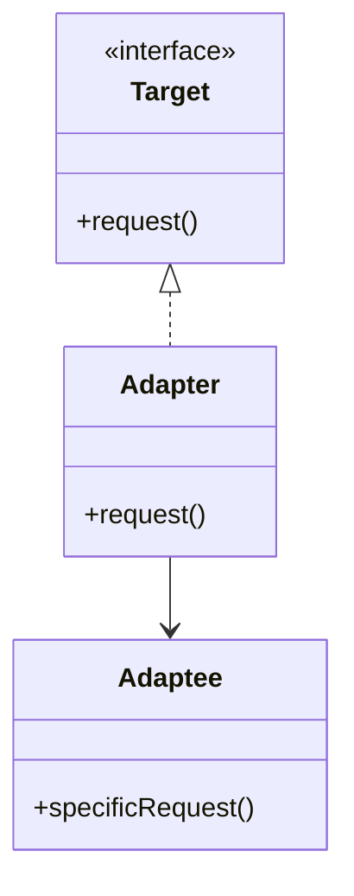

# Adapter Pattern

## Structure (diagram)



## Python

```python
class LegacyPrinter:
    def old_print(self, text: str) -> None:
        print(text.upper())


class PrinterTarget:
    def print_document(self, text: str) -> None:
        raise NotImplementedError


class PrinterAdapter(PrinterTarget):
    def __init__(self, legacy: LegacyPrinter) -> None:
        self._legacy = legacy

    def print_document(self, text: str) -> None:
        self._legacy.old_print(text)


PrinterAdapter(LegacyPrinter()).print_document("hello")
```

## Java

```java
interface PrinterTarget {
    void printDocument(String text);
}

class LegacyPrinter {
    void oldPrint(String text) {
        System.out.println(text.toUpperCase());
    }
}

class PrinterAdapter implements PrinterTarget {
    private final LegacyPrinter legacy;

    PrinterAdapter(LegacyPrinter legacy) {
        this.legacy = legacy;
    }

    public void printDocument(String text) {
        legacy.oldPrint(text);
    }
}
```
