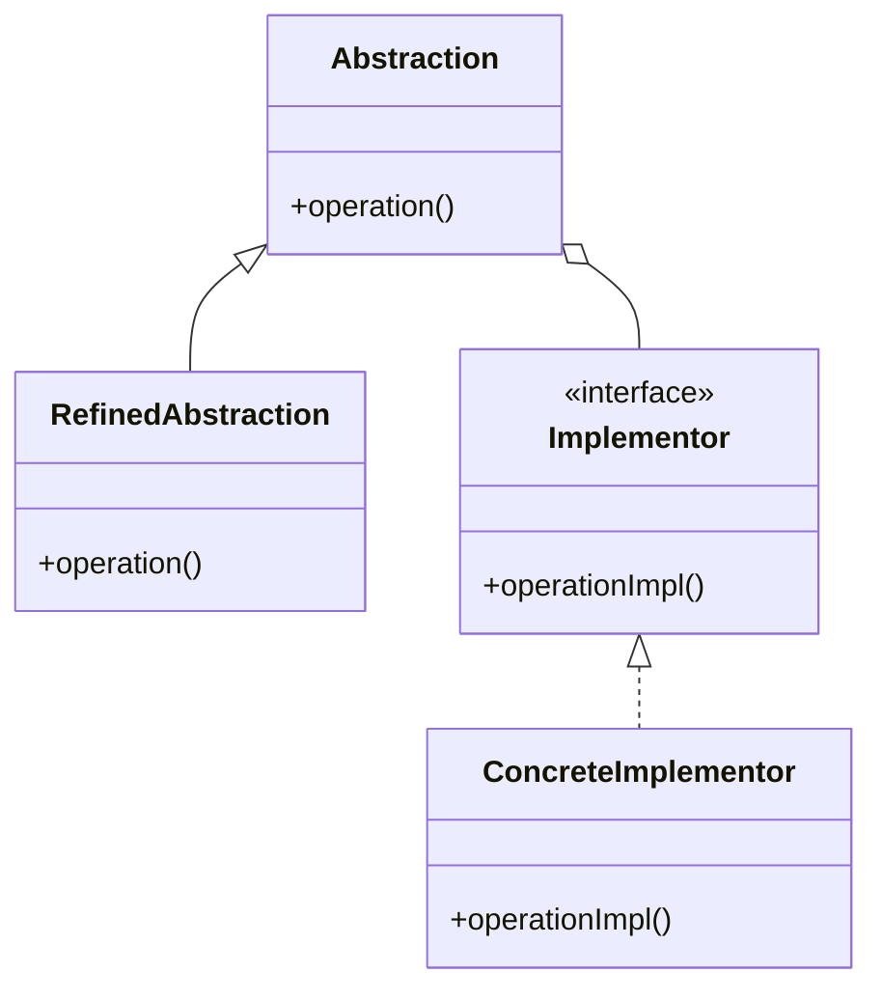

# Bridge Pattern

## Structure (diagram)



## Python

```python
from abc import ABC, abstractmethod


class Renderer(ABC):
    @abstractmethod
    def render_circle(self, r: float) -> None: ...


class VectorRenderer(Renderer):
    def render_circle(self, r: float) -> None:
        print(f"Vector circle r={r}")


class RasterRenderer(Renderer):
    def render_circle(self, r: float) -> None:
        print(f"Raster circle r={r}")


class Shape:
    def __init__(self, renderer: Renderer) -> None:
        self._renderer = renderer


class Circle(Shape):
    def __init__(self, renderer: Renderer, radius: float) -> None:
        super().__init__(renderer)
        self._radius = radius

    def draw(self) -> None:
        self._renderer.render_circle(self._radius)


Circle(VectorRenderer(), 5).draw()
```

## Java

```java
interface Renderer {
    void renderCircle(double r);
}

class VectorRenderer implements Renderer {
    public void renderCircle(double r) {
        System.out.println("Vector circle r=" + r);
    }
}

abstract class Shape {
    protected final Renderer renderer;
    Shape(Renderer r) { this.renderer = r; }
}

class Circle extends Shape {
    private final double radius;
    Circle(Renderer r, double radius) {
        super(r);
        this.radius = radius;
    }
    void draw() { renderer.renderCircle(radius); }
}
```
