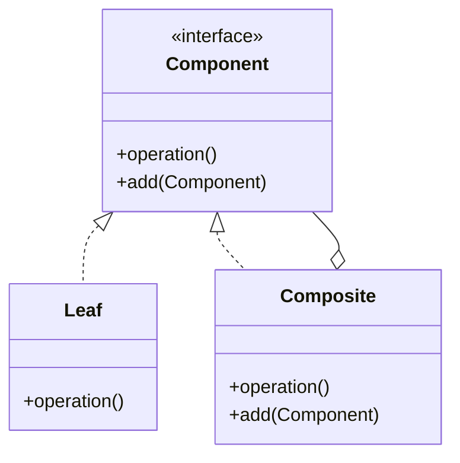

# Composite Pattern

## Structure (diagram)



## Python

```python
from abc import ABC, abstractmethod


class Graphic(ABC):
    @abstractmethod
    def draw(self, indent: int = 0) -> None: ...


class Dot(Graphic):
    def draw(self, indent: int = 0) -> None:
        print("  " * indent + "dot")


class CompositeGraphic(Graphic):
    def __init__(self) -> None:
        self._children: list[Graphic] = []

    def add(self, g: Graphic) -> None:
        self._children.append(g)

    def draw(self, indent: int = 0) -> None:
        print("  " * indent + "group")
        for c in self._children:
            c.draw(indent + 1)


root = CompositeGraphic()
root.add(Dot())
inner = CompositeGraphic()
inner.add(Dot())
root.add(inner)
root.draw()
```

## Java

```java
import java.util.*;

interface Graphic {
    void draw(int indent);
}

class Dot implements Graphic {
    public void draw(int indent) {
        System.out.println("  ".repeat(indent) + "dot");
    }
}

class CompositeGraphic implements Graphic {
    private final List<Graphic> children = new ArrayList<>();
    void add(Graphic g) { children.add(g); }
    public void draw(int indent) {
        System.out.println("  ".repeat(indent) + "group");
        for (Graphic g : children) g.draw(indent + 1);
    }
}
```
