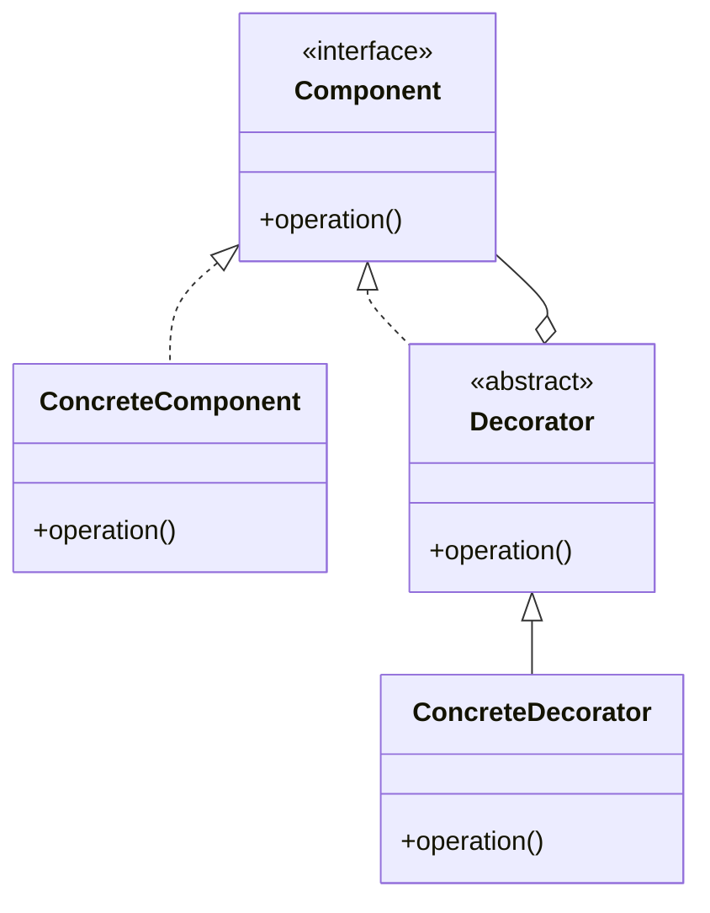

# Decorator Pattern

## Structure (diagram)



## Python

```python
from abc import ABC, abstractmethod


class Coffee(ABC):
    @abstractmethod
    def cost(self) -> float: ...


class SimpleCoffee(Coffee):
    def cost(self) -> float:
        return 2.0


class MilkDecorator(Coffee):
    def __init__(self, inner: Coffee) -> None:
        self._inner = inner

    def cost(self) -> float:
        return self._inner.cost() + 0.5


print(MilkDecorator(SimpleCoffee()).cost())
```

## Java

```java
interface Coffee {
    double cost();
}

class SimpleCoffee implements Coffee {
    public double cost() { return 2.0; }
}

class MilkDecorator implements Coffee {
    private final Coffee inner;
    MilkDecorator(Coffee inner) { this.inner = inner; }
    public double cost() { return inner.cost() + 0.5; }
}
```
