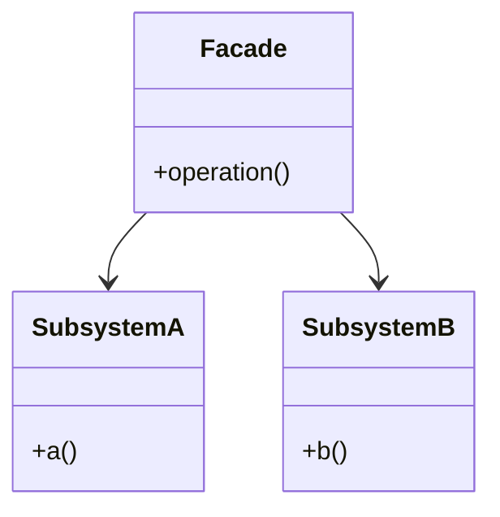

# Facade Pattern

## Structure (diagram)



## Python

```python
class Cpu:
    def freeze(self) -> None:
        print("cpu freeze")


class Memory:
    def load(self, addr: int, data: str) -> None:
        print(f"mem load {addr} {data}")


class HardDrive:
    def read(self, sector: int, size: int) -> str:
        return "boot"


class ComputerFacade:
    def __init__(self) -> None:
        self._cpu = Cpu()
        self._mem = Memory()
        self._hd = HardDrive()

    def start(self) -> None:
        self._cpu.freeze()
        data = self._hd.read(0, 1024)
        self._mem.load(0, data)


ComputerFacade().start()
```

## Java

```java
class Cpu {
    void freeze() { System.out.println("cpu freeze"); }
}
class Memory {
    void load(int addr, String data) {
        System.out.println("mem load " + addr + " " + data);
    }
}
class HardDrive {
    String read(int sector, int size) { return "boot"; }
}

class ComputerFacade {
    private final Cpu cpu = new Cpu();
    private final Memory mem = new Memory();
    private final HardDrive hd = new HardDrive();

    void start() {
        cpu.freeze();
        String data = hd.read(0, 1024);
        mem.load(0, data);
    }
}
```
