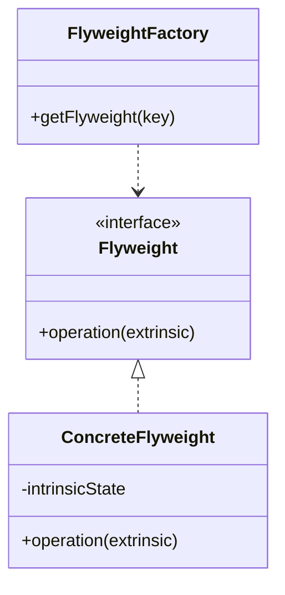

# Flyweight Pattern

## Structure (diagram)



## Python

```python
class TreeType:
    def __init__(self, name: str, color: str) -> None:
        self._name = name
        self._color = color

    def draw(self, x: int, y: int) -> None:
        print(f"{self._name}({self._color}) at {x},{y}")


class TreeFactory:
    _cache: dict[tuple[str, str], TreeType] = {}

    @classmethod
    def get(cls, name: str, color: str) -> TreeType:
        key = (name, color)
        if key not in cls._cache:
            cls._cache[key] = TreeType(name, color)
        return cls._cache[key]


oak1 = TreeFactory.get("oak", "green")
oak2 = TreeFactory.get("oak", "green")
assert oak1 is oak2
oak1.draw(1, 2)
```

## Java

```java
import java.util.*;

final class TreeType {
    private final String name;
    private final String color;
    TreeType(String name, String color) {
        this.name = name;
        this.color = color;
    }
    void draw(int x, int y) {
        System.out.println(name + "(" + color + ") at " + x + "," + y);
    }
}

final class TreeFactory {
    private static final Map<String, TreeType> cache = new HashMap<>();

    static TreeType get(String name, String color) {
        String key = name + "|" + color;
        cache.putIfAbsent(key, new TreeType(name, color));
        return cache.get(key);
    }
}
```
