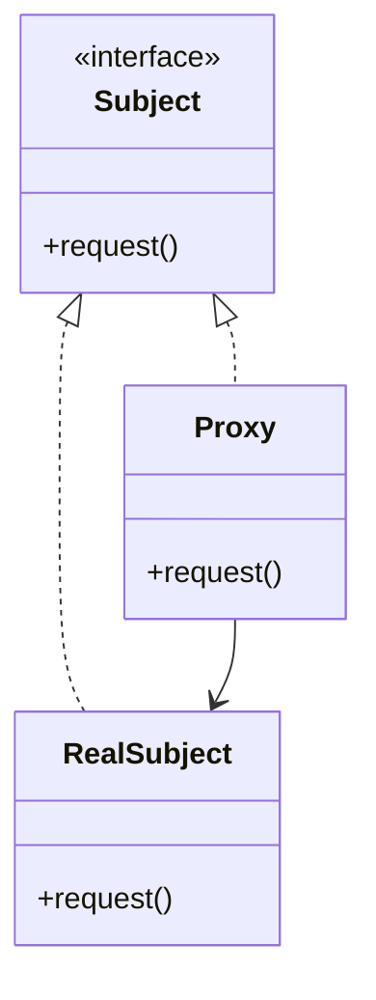

# Proxy Pattern

## Structure (diagram)



## Python

```python
from abc import ABC, abstractmethod


class Image(ABC):
    @abstractmethod
    def display(self) -> None: ...


class RealImage(Image):
    def __init__(self, filename: str) -> None:
        self._filename = filename
        self._load()

    def _load(self) -> None:
        print(f"load {self._filename}")

    def display(self) -> None:
        print(f"show {self._filename}")


class ImageProxy(Image):
    def __init__(self, filename: str) -> None:
        self._filename = filename
        self._real: RealImage | None = None

    def display(self) -> None:
        if self._real is None:
            self._real = RealImage(self._filename)
        self._real.display()


ImageProxy("photo.png").display()
```

## Java

```java
interface Image {
    void display();
}

class RealImage implements Image {
    private final String filename;
    RealImage(String filename) {
        this.filename = filename;
        load();
    }
    private void load() {
        System.out.println("load " + filename);
    }
    public void display() {
        System.out.println("show " + filename);
    }
}

class ImageProxy implements Image {
    private final String filename;
    private RealImage real;

    ImageProxy(String filename) {
        this.filename = filename;
    }

    public void display() {
        if (real == null) real = new RealImage(filename);
        real.display();
    }
}
```
